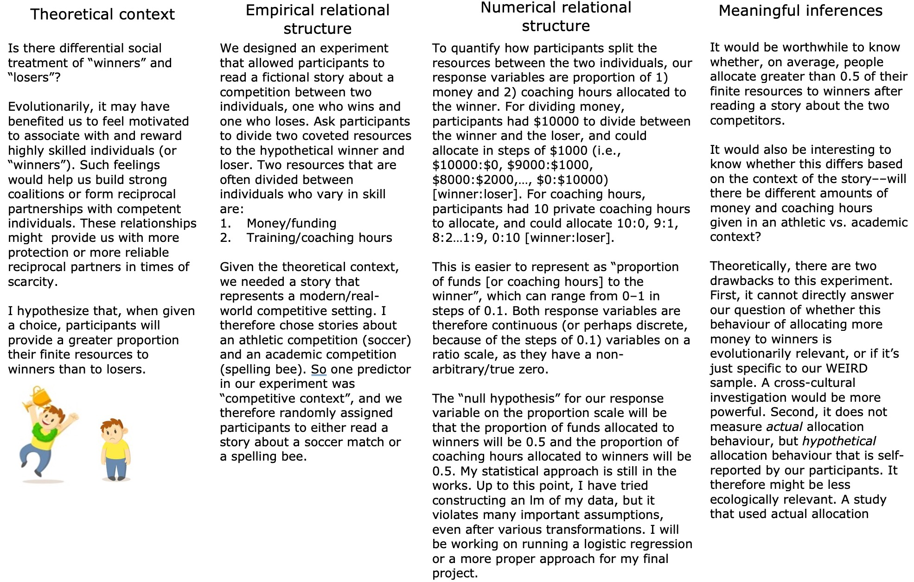

---
---
---

# Noah Smith QMEE homework 6

### Question 1a:

### Question 1b:

My two main response variables (proportion of funds allocated to winner and proportion of coaching hours allocated to winner) are continuous variables on the ratio scale. This means that, if participant A allocates 0.8 of their funds to the winner and participant B allocates 0.1 of their funds to the winner, participant A has allocated 8 times as much. And if participant C allocated 0.4 of their funds to the winner, they allocated half of what participant A allocated and 4 times what participant B allocated. I can therefore take the mean of my response variable and compare it to my null of 0.5, as the mean for continuous ratio variables is a meaningful measure. If my response variables had been nominal (e.g., "all funds to winner" as 1, and "no funds to winner" as 0), then a mean measure would be meaningless. Similarly, if my response variables were ordinal instead of continuous ratio variables, then I also wouldn't be able to compare my mean to my null--in the cases of nominal or ordinal data, it would make more sense to use the median or mode response. In terms of the inferential approach, I have tried several up to this point, including a one-sample t-test, a separate linear model that includes my various predictor variables (which violates several important assumptions), and when we learn permutations I am interested to see if they are appropriate for my data, given their lack of reliance on some assumptions that my lm is probably violating. I had asked Ben if a one-sample permutation test would be feasible, and he seemed to indicate that it would not be, but I am interested to learn more about this next week.

### Question 2a:

For both of my continuous response variables (proportion of funds allocated to winner and proportion of coaching hours allocated to the winner), I will be using Cohen's d. Although Nakagawa & Cuthill (2007) note that Hedges' G provides a "correction" to Cohen's d, but that Hedges' G is most useful for investigations with fairly low sample sizes. Underpowered studies/studies with small sample sizes are more prone to generating inflated effect sizes, and Hedges' G remedies that problem. However, since my study is appropriately powered (having 170 individuals, or about 85 observations for the two competitive contexts, and it met the threshold outlined in an a priori power analysis), I feel that using Cohen's d is appropriate here. In particular, I will calculate a standardized effect comparing the mean proportion of funds and coaching hours allocated to the winner to my null of 0.5.

The historical context of Cohen's d is somewhat dicey, as it has (potentially) contributed to the replication crisis in experimental psychology and sociology. For several decades, underpowered samples in experimental psychology generated deflated p-values and inflated effect sizes, the latter of which were often calculated with Cohen's d (either that, or effect size estimates were completely omitted) (Nakagawa and Cuthill, 2007; Simmons et al., 2011). Tiny p-values and inflated effect sizes have fostered confusion and frustration among modern experimental psychologists and the general public. For example, many of the results on subconscious priming or unconscious biases in Daniel Kahneman's "Thinking Fast and Slow" does not replicate, despite low p-values and promising effect sizes. Although Kahneman has since addressed these issues (Yong, 2012), I do not agree with the historical precedent for using Cohen's d in my field, as it often didn't include pondering a typical effect size in the field or the power required to reliably detect the effect of study. The ultimate impact and reach of these inflated effects highlights the importance of developing a proper philosophy around analysis, interpretation, and reporting of effect sizes.

References

Nakagawa, S., & Cuthill, I. C. (2007). Effect size, confidence interval and statistical significance: a practical guide for biologists. *Biological reviews*, *82*(4), 591-605.

Simmons, J. P., Nelson, L. D., & Simonsohn, U. (2011). False-positive psychology: Undisclosed flexibility in data collection and analysis allows presenting anything as significant. *Psychological science,* 22(11), 1359-1366.

Yong, E. (2012). Nobel laureate challenges psychologists to clean up their act. Nature, 490, 7418.

### Question 2b

I'll be computing two effect size estimates using Cohen's d—one effect size estimate for each of the two response variables (proportion of funds allocated to winner and proportion of coaching hours allocated to winner). Both effect size estimates will represent a one-sample comparison; I'm comparing the sample mean of the two response variables to my null value of 0.5. For the two effect size estimates, I'm using solely standard deviation of the relevant response variable to scale the effect size measure (not a pooled standard deviation measure). Scaling via standard deviation is advantageous as it allows for more reliable comparisons of effect sizes across studies and for meta-analytic approaches if desired (but see 2c for some caveats on this). Also, for my own follow-up studies, having this measure of effect size scaled by standard deviation will give me a better reference point for power and sample size.

### Question 2c

First, the positive aspects of using Cohen's d scaled with sample standard deviation is that it may allow me to compare my own effect size estimates to some others in my field. For example, last Fall I conducted a study on human winner and loser effects in videogames (Smith & Dukas, 2024), and I'll be able to compare the effect size estimates I get from this investigation to the estimates I got in that investigation. This will allow me to generate a more cohesive PhD thesis, as I will be able to comment on the relative size of these effects in comparison to one another. Similarly, I will be able to use my past and future effect size estimates to inform power analyses for follow-up studies. Furthermore, external investigators may be able to include my reported effect size measures in a meta-analysis to generate more insight into the true effect sizes of these measures. Importantly, individuals from other fields may also be able to use the effect size measures I've generated to inform how they design their own studies. My own investigation of allocation to "winners" and "losers" ties into human evolutionary psychology, behavioural economics, sociology, and equity studies, so all of these fields may be able to use my standardized effect sizes to give them an idea of what to expect when they are studying things like how people split up resources based on context.

Unfortunately, the effect size estimates I generate in this study will suffer from several shortcomings. First, when attempting to compare them to other effect size estimates—including my own from the other investigations I've run—I run into some immediate issues. The methodologies of my earlier investigations and this investigation are different, so it's clear the comparison will not be a perfect 1:1 representation. For example, if I find an effect size of 0.8 here, and initially found an effect size of 0.2 in my original study, it would be improper to say that "this effect is four times as large as my earlier effects." Although it would seem that way on paper, I have to acknowledge that the current methodology employs self-report measures for the response variables, while my earlier investigations employed behavioural measures for the response variables. So, one immediate drawback is that Cohen's d makes it *seem* like my earlier results and current results are highly comparable, when in fact the story is more complicated than that. For example, since my current investigation used self-report measures, the response variables could be slightly skewed by impression management (Lajunjen & Summala, 2003). I.e., participants could report in a way that upheld their self-image, as opposed to reporting in a fully honest way. Conversely, the response variables in my first investigations relied on recording participant behaviour, meaning they would be less or not at all prone to impression management. I would hope that when other investigators try to interpret my reported effect size measures, they also consider these issues. However, I would also be as transparent as possible while discussing the effects. Also, my previous investigations used a pooled standard deviation measure to scale effect size, while this investigation uses a sample standard deviation to scale effect size. This could also influence the relative size of the effects, as a pooled standard deviation will tend to be less noisy, while a sample standard deviation might be more prone to generating atypically high or low values, potentially inflating or deflating the effect size. Finally, although I feel like I'm beating a dead horse, my sample is (unfortunately) WEIRD (Henrich et al., 2010). My participants are all Western, Educated, Industrialized, Rich, and Democratic (WEIRD), since I sampled from McMaster's undergraduate students. Since I sampled specifically from students taking an undergraduate psychology course, my sample inevitably contains far less variation than the ideal sample should in behavioural science. Individuals trying to make conclusions about behaviour in other cultures based on my reported effect sizes should use caution.

References

Henrich, J., Heine, S. J., & Norenzayan, A. (2010). Most people are not WEIRD. Nature, 466(7302), 29-29.

Lajunen, T., & Summala, H. (2003). Can we trust self-reports of driving? Effects of impression management on driver behaviour questionnaire responses. Transportation research part F: traffic psychology and behaviour, 6(2), 97-107.

Smith, N. M., & Dukas, R. (2024). Winner and loser effects in humans: evidence from randomized trials. Animal Behaviour, 207, 101-107.

### Question 2d

d\. Using what you learned from watching the video from Dr. Megan Higgs, on the Meaning of Magnitude, I would like you to develop a scale of magnitudes (Backdrop of meaning in magnitude) for your own work and for the measure of effect you are using. Please feel free to use any prior sources of literature from your field to help develop this. Explain your rationale for regions that you a priori consider to be unlikely of biological/environmental/clinical significance, VS. the “grey area” VS. regions of practical relevance?

### Question 2e

1: The confidence interval for this effect is visibly within only the “not of practical/meaningful biological relevance”, so I would interpret it as such. Although there is a significant (or “clear”) effect, our a priori criteria indicates that the effect has no practical implications for our system/investigation.

2: This effect’s confidence interval indicates that there could be many things going on here. Based solely on NHST, this would be a non-significant (or statistically unclear) effect, since the confidence interval overlaps zero. However, it would be premature to draw any strong conclusions about the effect, and I would prefer to discuss this with my colleagues or collect more data if possible.

3: There is a clear (significant) effect (as the confidence interval doesn’t overlap 0), that is within our a priori range of “biologically relevant”. Based on our a priori criteria, I would infer that this effect is important to our investigation.

4: There is a clear (significant) effect, but I’m uncertain about making strong inferences. Although most of the effect’s confidence interval is in the “biologically relevant” section, it also crosses into the “grey area”. I would exercise caution in interpreting the effect. However, it is likely important to our investigation an I would discuss it with my colleagues or collect more data if possible.

5: There is a clear (significant) effect, but it is distributed across “not biologically relevant”, “grey area”, and “biologically relevant”. It’s therefore difficult to make any strong inferences about this result, so I would discuss it with my colleagues and would prefer to collect more data if possible.

6: There is a clear (significant) effect, but it is quite small, distributed evenly between the “not biologically relevant” and “grey area” sections. Our a priori criteria indicate that this effect is likely not very important to our investigation.

7: There is an unclear (or non-significant) effect, since the confidence interval overlaps 0. However, even if the effect were statistically clear (e.g., if we collected more data and the confidence interval shrunk slightly and no longer crossed 0), the effect would still not carry any biological relevance for our investigation.
