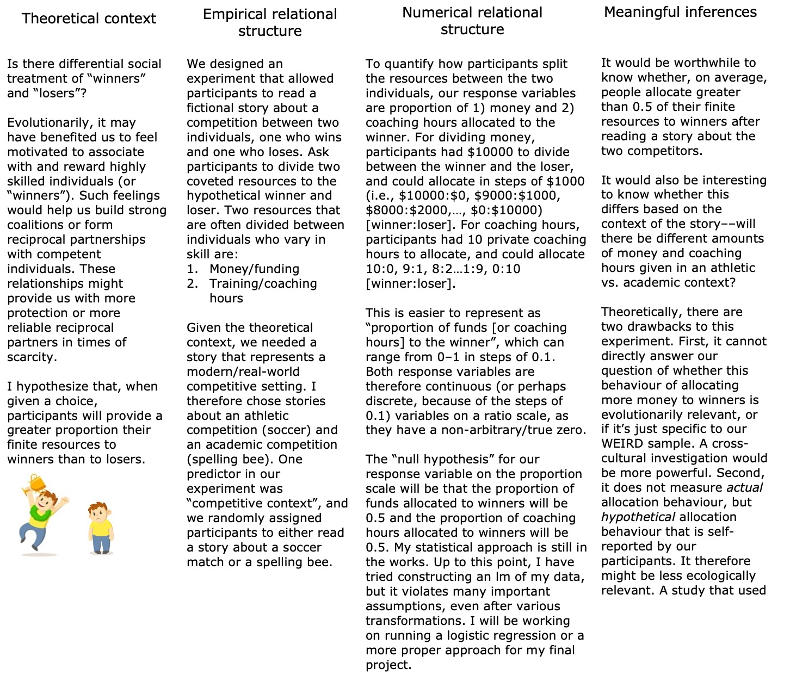

# Noah Smith QMEE homework 6

### Question 1a:

### Question 1b:

My two main response variables (proportion of funds allocated to winner and proportion of coaching hours allocated to winner) are continuous variables on the ratio scale. This means that, if participant A allocates 0.8 of their funds to the winner and participant B allocates 0.1 of their funds to the winner, participant A has allocated 8 times as much. And if participant C allocated 0.4 of their funds to the winner, they allocated half of what participant A allocated and 4 times what participant B allocated. I can therefore take the mean of my response variable and compare it to my null of 0.5, as the mean for continuous ratio variables is a meaningful measure. If my response variables had been nominal (e.g., "all funds to winner" as 1, and "no funds to winner" as 0), then a mean measure would be meaningless. Similarly, if my response variables were ordinal instead of continuous ratio variables, then I also wouldn't be able to compare my mean to my null--in the cases of nominal or ordinal data, it would make more sense to use the median or mode response. In terms of the inferential approach, I have tried several up to this point, including a one-sample t-test, a separate linear model that includes my various predictor variables (which violates several important assumptions), and when we learn permutations I am interested to see if they are appropriate for my data, given their lack of reliance on some assumptions that my lm is probably violating. I had asked Ben if a one-sample permutation test would be feasible, and he seemed to indicate that it would not be, but I am interested to learn more about this next week.
